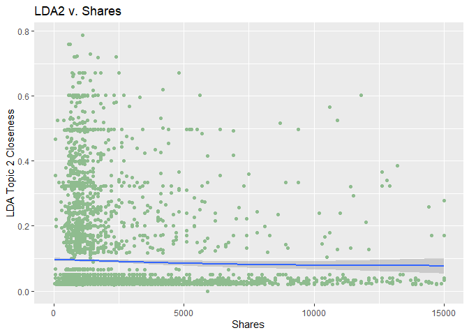
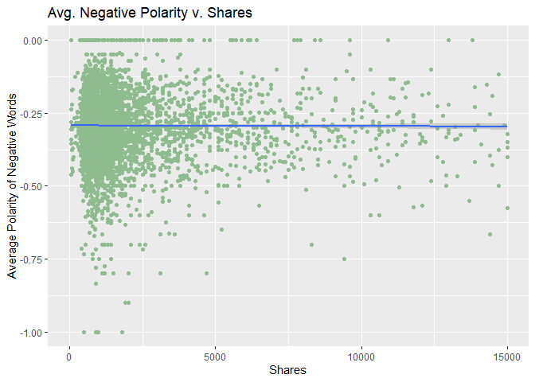
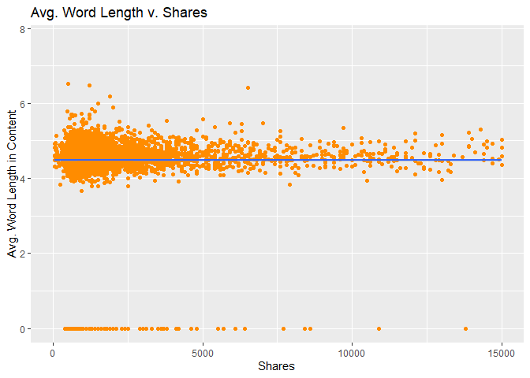
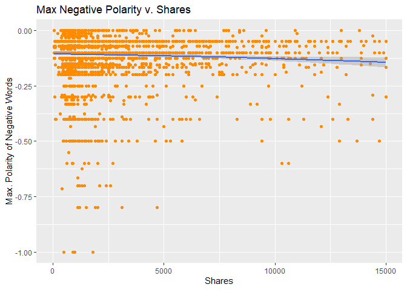
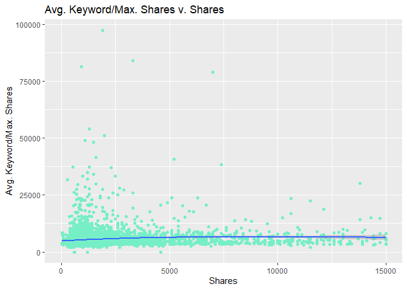
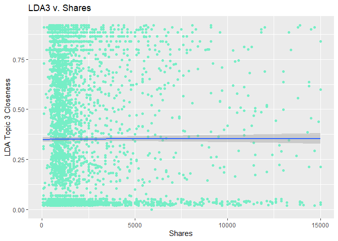
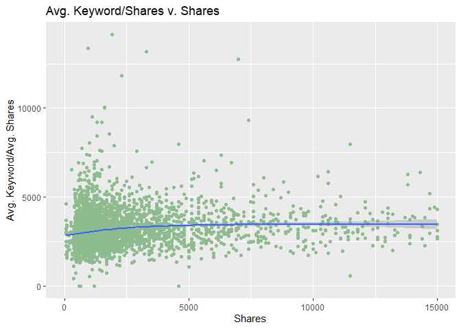
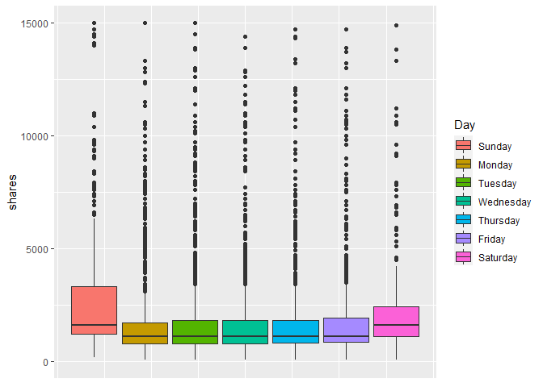

A report for entertainment channel
================

# Introduction

The data we are working on comes from the [Online News Popularity Data
Set](https://archive.ics.uci.edu/ml/datasets/Online+News+Popularity)

From this data set, we have decided to work on the following variables:

-   `shares`: The target variable, the number of shares a particular
    article has
-   `LDA_02`: Closeness to LDA topic 2
-   `avg_negative_polarity`: Average polarity of negative words
-   `average_token_length`: Average length of the words in the content
-   `max_negative_polarity`: Maximum polarity of negative words
-   `kw_max_avg`: Average keyword (max. shares)
-   `LDA_03`: Closeness to LDA topic 3
-   `kw_avg_avg`: Average keyword (avg. shares),
-   `weekday_is_...`: Which day of the week the article was written on

The goal of the analysis is to predict the number of shares based on the
other variables.

# Data

``` r
library(tidyverse)

set.seed(3)

# Import News
news <- read_csv("OnlineNewsPopularity/OnlineNewsPopularity.csv")

# Split by channel
news <- news %>%
  pivot_longer(starts_with("data_channel_is_"), 
               names_prefix = "data_channel_is_",
               names_to = "channel") %>%
  filter(value == 1) %>%
  select(-value) %>%
  split(.$channel) 

# Work on channel supplied by params
newsData <- news[[params$data_channel]]
```

## Splitting the data

``` r
library(caret)

## Setup new data set with only variables of interest
newsSubFinal <- newsData %>% 
  select(LDA_02, avg_negative_polarity, average_token_length, 
         max_negative_polarity, kw_max_avg, LDA_03, kw_avg_avg, 
         weekday_is_monday, weekday_is_tuesday, weekday_is_wednesday, 
         weekday_is_thursday, weekday_is_friday, 
         weekday_is_saturday, weekday_is_sunday, shares)

## Train/Test Split
trainIndex <- createDataPartition(newsSubFinal$shares, p = .70, list = FALSE)
newsTrain <- newsSubFinal[trainIndex, ]
newsTest <- newsSubFinal[-trainIndex, ]
```

# Summarizations

**Mean and Standard Deviation**:  
We want to look at how the means of all of the variables differ across
all the reports(data channels). We want to look specifically at the
shares and see which data channel has the highest amount and which has
the lowest. Similarly for the standard deviation we want to see how
these values differ across data channels. Which data channels have the
smallest amount of variance and which have the least. \* If the number
of shares increase are increaseing as we move to the right than that
specific predictor has a positive effecc on the number of shares. \* If
the number of shares are decreasing then we can say that specific
predictor has negative effect on the number of shares.

``` r
contVars <- newsTest %>%
  select(-starts_with("weekday"))
data.frame(Means = colMeans(contVars), StdDev = sapply(contVars, sd)) %>% 
  format(scientific = FALSE)
```

    ##                               Means       StdDev
    ## LDA_02                   0.08645517    0.1258698
    ## avg_negative_polarity   -0.29544463    0.1277100
    ## average_token_length     4.47879715    0.8065300
    ## max_negative_polarity   -0.11244567    0.1006140
    ## kw_max_avg            5817.93690347 6046.0254913
    ## LDA_03                   0.36591323    0.3347131
    ## kw_avg_avg            3215.43939514 1334.0515478
    ## shares                2933.51465028 7761.9937991

**Contingencies**:  
Below we should analyze how the counts for each publishing day differed
across data channels.  
In the Boxplots below we can see how the number of shares differed for
the different  
publishing days.

``` r
# Convert weekday_is columns to factors
newsDays <- newsTrain %>%
  pivot_longer(starts_with("weekday_is_"), 
               names_prefix = "weekday_is_",
               names_to = "Day",
               names_transform = list(
                 Day = ~ readr::parse_factor(stringr::str_to_title(.x), 
                                             levels = c("Sunday", "Monday",
                                                        "Tuesday", "Wednesday",
                                                        "Thursday", "Friday",
                                                        "Saturday"))
               )) %>%
  filter(value == 1) %>%
  select(-value)

# Display number of articles published on a given weekday
table(newsDays$Day)
```

    ## 
    ##    Sunday    Monday   Tuesday Wednesday  Thursday    Friday  Saturday 
    ##       371       950       948       900       818       685       269

**Correlation Plots** for Numeric variables used:  
Let’s analyze the plots below to see if we can identify any positive or
negative relationships between the shares and the predictor.

``` r
## It seems like very few observations have shares greater than 15000
## Fixing range for better visuals
ggplot(data = newsTrain, aes(shares, LDA_02)) +
  geom_point(color="darkseagreen") +
  geom_smooth() +
  labs(x = "Shares", y = "LDA Topic 2 Closeness", title = "LDA2 v. Shares") +
  xlim(0, 15000) 
```

<!-- -->

``` r
ggplot(data = newsTrain, aes(shares, avg_negative_polarity)) +
  geom_point(color="darkseagreen") +
  geom_smooth() +
  labs(x = "Shares", y = "Average Polarity of Negative Words", 
       title = "Avg. Negative Polarity v. Shares") +
  xlim(0, 15000) 
```

<!-- -->

``` r
ggplot(data = newsTrain, aes(shares, average_token_length)) +
  geom_point(color="darkorange") +
  geom_smooth() +
  labs(x = "Shares", y = "Avg. Word Length in Content", 
       title = "Avg. Word Length v. Shares") +
  xlim(0, 15000) 
```

<!-- -->

``` r
ggplot(data = newsTrain, aes(shares, max_negative_polarity)) +
  geom_point(color="darkorange") +
  geom_smooth() +
  labs(x = "Shares", y = "Max. Polarity of Negative Words", 
       title = "Max Negative Polarity v. Shares") +
  xlim(0, 15000) 
```

<!-- -->

``` r
ggplot(data = newsTrain, aes(shares, kw_max_avg)) +
  geom_point(color="aquamarine2") +
  geom_smooth() +
  labs(x = "Shares", y = "Avg. Keyword/Max. Shares", 
       title = "Avg. Keyword/Max. Shares v. Shares") +
  xlim(0, 15000)
```

<!-- -->

``` r
ggplot(data = newsTrain, aes(shares, LDA_03)) +
  geom_point(color="aquamarine2") +
  geom_smooth() +
  labs(x = "Shares", y = "LDA Topic 3 Closeness", 
       title = "LDA3 v. Shares") +
  xlim(0, 15000)
```

<!-- -->

``` r
ggplot(data = newsTrain, aes(shares, kw_avg_avg)) +
  geom_point(color="darkseagreen") +
  geom_smooth() +
  labs(x = "Shares", y = "Avg. Keyword/Avg. Shares", 
       title = "Avg. Keyword/Shares v. Shares") +
  xlim(0, 15000) 
```

<!-- -->

**Boxplot**(for categorical variable used):

``` r
ggplot(newsDays, aes(shares)) + 
  coord_flip() +
  geom_boxplot(aes(fill=Day)) +
  theme(axis.ticks.x = element_blank(),
        axis.text.x = element_blank()) +
  xlim(0, 15000)
```

<!-- -->

# Modeling

## Linear Regression

Linear regression is used to model the relationship between a continuous
response and one or more explanatory variables. It can be used for both
prediction and for inference. Linear regression models are usually
fitted by minimizing the least squares residuals(although other methods
exist) to estimate the betas. The term linear is in reference to the
betas(parameters) not necessarily linear in the predictors. The
predictors can have polynomial terms and can also be categorical.

-   SLR = Regression with only one predictor.
-   MLR = Regression with more than one predictor.

``` r
fullLM <- train(shares ~ ., data = newsTrain,
                method = "lm",
                preProcess = c("center", "scale"),
                trControl = trainControl(method = "cv", number= 5))
pred <- predict(fullLM, select(newsTest, -shares))
testFullLM <- postResample(pred, newsTest$shares)
```

``` r
library(leaps)
fwdFit <- train(shares ~ ., data = newsTrain,
                method = "leapForward",
                preProcess = c("center", "scale"),
                trControl = trainControl(method = "cv", number= 5),
                verbose = FALSE)
pred <- predict(fwdFit, select(newsTest, -shares))
testFwdFit <- postResample(pred, newsTest$shares)
```

## Random Forest

Random Forest is an ensemble tree based method used for prediction.
Similar to other ensemble methods it averages across trees in order to
obtain it’s predictions. Random Forest extends the idea of bagging but
does not use all predictors but instead uses a random subset for each
tree fit(from bootstrap sample). The goal is to reduce correlation and
reduce variance.

``` r
rfFit <- train(shares ~ ., data = newsTrain,
               method = "rf",
               preProcess = c("center", "scale"),
               trControl = trainControl(method = "cv", number = 5),
               verbose = FALSE)
pred <- predict(rfFit, select(newsTest, -shares))
testRfFit <- postResample(pred, newsTest$shares)
```

## Boosted Tree

Boosted tree is another ensemble that uses sequential learning in order
to improve prediction. Instead of creating trees that are independent of
each other like a random forest, each tree learns from by considering
the errors coming from the previous tree. Since boosting is an iterative
process, it is hard to parallelize this method and is the primary
drawback fo the boosting method.

``` r
gbmFit <- train(shares ~ ., data = newsTrain,
                method = "gbm",
                preProcess = c("center", "scale"),
                trControl = trainControl(method = "cv", number= 5),
                verbose = FALSE)
pred <- predict(gbmFit, select(newsTest, -shares))
testGbmFit <- postResample(pred, newsTest$shares)
```

# Comparison

Let’s compare the methods:

``` r
(comp <- bind_rows(list(fullLM = testFullLM, 
                        fwdFit = testFwdFit, 
                        rfFit = testRfFit, 
                        gbmFit = testGbmFit), .id = "id"))
```

    ## # A tibble: 4 x 4
    ##   id      RMSE Rsquared   MAE
    ##   <chr>  <dbl>    <dbl> <dbl>
    ## 1 fullLM 7533.   0.0643 2894.
    ## 2 fwdFit 7513.   0.0722 2888.
    ## 3 rfFit  7697.   0.0197 2974.
    ## 4 gbmFit 7604.   0.0431 2887.

``` r
bestMethod <- slice(comp, which.min(comp$RMSE))$id
```

The best method is **fwdFit**

# Automation

Below is the manual part that has to be done in order to kick off the
automated reports.

``` r
## Create file names
data_channels <- names(news)
output_file <- paste0(data_channels, ".md")

## Create list for each data channel with just the channel name param.
params <- lapply(data_channels, FUN = function(x){list(data_channel = x)})

## Put into df
reports <- tibble(output_file, params)

## Render code
apply(reports, MARGIN = 1,
      FUN = function(x){
        rmarkdown::render(input = "ST558-Project2.Rmd",
               output_format = "github_document",
               output_file = x[[1]],
               output_options = list(html_preview = FALSE),
               params = x[[2]])
      })
```
